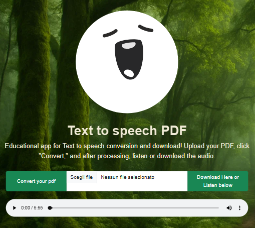

# py-tts Python Text to Speech

## Overview

**py-tts** is a Python-based web application that converts PDF documents to speech audio files. Built with Flask and Jinja2, it allows users to upload a PDF, extracts the text, and generates an audio file using a text-to-speech engine.

<p align="center">
    
</p>

## Features

- Upload PDF files and convert their text to speech
- Simple web interface with HTML, Bootstrap and Jinja2 templates
- Audio output (MP3) for playback or download

## Getting Started

### Prerequisites

- Python 3.7+
- Flask
- pdfminer.six
- pyt2s (or your preferred TTS library)

### Installation

```bash
git clone https://github.com/yourusername/py-tts.git
cd py-tts
pip install -r requirements.txt
```

### Running the Application

```bash
python app.py
```

Visit `http://127.0.0.1:5000` in your browser.

## Usage

1. Upload a PDF file using the web interface.
2. The app extracts the text and converts it to speech.
3. Listen to or download the generated audio file.

## Example Code

```python
from flask import Flask, render_template, request
from utility import text_to_speach, extract_text_from_pdf, UPLOADED_PDF, AUDIO_PATH, check_upload
import os

app = Flask(__name__)
app.config['UPLOAD_FOLDER'] = './static/uploads'

@app.route("/", methods=["GET"])
def home():
    has_uploaded = check_upload()
    return render_template("index.html", has_uploaded=has_uploaded)

@app.route("/upload", methods=["POST"])
def upload():
    file_pdf = request.files['doc_pdf']
    file_pdf.save(os.path.join(app.config['UPLOAD_FOLDER'], UPLOADED_PDF))
    text = extract_text_from_pdf()
    text_to_speach(text)
    return home()

if __name__ == "__main__":
    app.run(debug=True)
```

## License

This project is licensed under the MIT License.